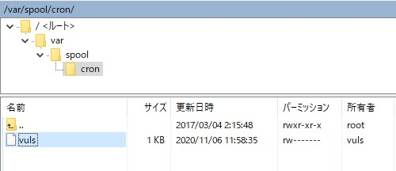
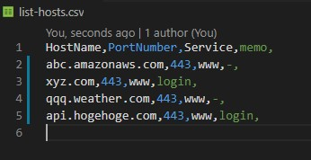

<!-- TOC -->

- [SSLサーバー証明書の有効期限を自動的に取得し更新漏れを防ぐツール](#sslサーバー証明書の有効期限を自動的に取得し更新漏れを防ぐツール)
  - [cacert-checkend.sh](#cacert-checkendsh)
  - [1. 概要](#1-概要)
  - [2. 出力イメージ](#2-出力イメージ)
  - [3. 動作環境および必要ファイル](#3-動作環境および必要ファイル)
  - [4. 実施内容](#4-実施内容)
    - [4.1 Linux (CentOS7)](#41-linux-centos7)
      - [4.1.1 ファイル構成と準備](#411-ファイル構成と準備)
      - [4.1.2 スケジュール](#412-スケジュール)
      - [4.1.3 サーバーリストファイル](#413-サーバーリストファイル)
      - [4.1.4 証明書の取得](#414-証明書の取得)
      - [4.1.5 Teame 通知](#415-teame-通知)
      - [4.1.6 ログ](#416-ログ)
  - [5. ライセンス License](#5-ライセンス-license)

<!-- /TOC -->
# SSLサーバー証明書の有効期限を自動的に取得し更新漏れを防ぐツール

## cacert-checkend.sh

---

## 1. 概要

- `SSL`サーバ証明書を有効期間内に間違いなく更新するために、自動的かつ定期的にサーバから証明書を取得し、期限切れ（有効期限の30日前）の有無を判定し通知するツール　

- 以下を参考にバッチファイルをシェルスクリプトにしたものです
  - [OpenSSLでSSLサーバ証明書の有効期間を自動的に確認して更新漏れを防ぐ](https://www.atmarkit.co.jp/ait/articles/1805/09/news036.html)

## 2. 出力イメージ

- 以下の内容を`Teams`のチャネルに投稿します
- `Teams`のチャネルには、あらかじめ`Incoming Webhook`を使ったコネクタを構築しておきます
- 30日以内に、証明書の有効期限が到来する場合
  - 
  - タイトルに、「チェック」と実施日を追加し以下のように変更した
  - 

- 30日以内に、証明書の有効期限が到来しない場合
  - サーバー毎に、以下の通知は行いません
  - 
  - サーバー一覧ファイルにあるすべてのサーバーの証明書が、更新間近でない場合は、以下の通知を行います
  - 

- 証明書が取得できなかった場合
  - 
  - `NotAfter`は、`null`から`NotAvailable`に変更しました

## 3. 動作環境および必要ファイル

- Linux (CentOS7)
  - `CentOS7`上のスケジューラ（`cron`）
  - シェルスクリプト`cacert-checkend.sh`
  - **【保守ファイル】** ドメイン名、ポート番号、サービス名を列挙したサーバーリストファイル`list-hosts.csv`（改行コードは`LF`のこと）

## 4. 実施内容

### 4.1 Linux (CentOS7)

- `cron`の所有者が`vuls`の場合、`vuls`の`cron`が、毎週**月曜日**の午前11時30分に、シェルスクリプト`cacert-checkend.sh`を自動的に実行するようにスケジューリングする

#### 4.1.1 ファイル構成と準備

- `/home/vuls/CAcert/`フォルダに`cacert-checkend.sh`を、共有フォルダに、`list-hosts.csv`を配置する

#### 4.1.2 スケジュール

- スケジュールは、`/var/spool/cron/vuls`に記述する
- 毎週月曜日の午前11時30分に実行する（下のリストの最下行）

  ```bash
  PATH=/sbin:/bin:/usr/bin:/usr/local/bin:/usr/local/sbin:/usr/sbin:/usr/local/go/  bin:/home/vuls/go/bin:/usr/lib/jvm/java/bin:/opt/apache-tomcat/apache-tomcat-7.0. 50/bin:/home/vuls/.local/bin:/home/vuls/bin:MAIL=/var/spool/mail/vuls
  # 分　時　日　月　曜日　コマンド
  05 6 * * 1-5 /home/vuls/vuls-auto2.sh full diff > /var/log/vuls/vuls-auto.log 2>&1
  00 15 * * 1-5 /home/vuls/z-today-mail2.sh > /var/log/vuls/z-today-mail.log 2>&1
  00 7 1 * * /home/vuls/Google/google_pwgen.sh > /home/vuls/Google/log/ google_pwgen.log 2>&1
  30 11 * * 1 /home/vuls/CAcert/cacert-checkend.sh > /home/vuls/CAcert/ cacert-checkend.log 2>&1
  ```
- 図
- 

#### 4.1.3 サーバーリストファイル

- `list-hosts.csv`には、以下の書式で記述する
- サーバー名（`HostName`）,ポート番号（`PortNumber`）,サービス種（`Service`）,その他情報（`memo`）
- `list-hosts.csv`の内容
- 

#### 4.1.4 証明書の取得

- サーバー証明書は、`openssl`（プロキシーの設定が必要な場合は、`openssl11`）コマンドを使って取得する
- コードの抜粋

  ```bash
    # Home: cron 用にフルパスで
    HOME="/home/vuls/CAcert/"
    
    # 認証局の証明書ファイルの在りかを指定
    OsslClientOpts="-CAfile /etc/ssl/certs/ca-bundle.crt"
    
    openssl11 s_client -proxy proxy.hoge.co.jp:3128 -connect $1:$2 ${OsslClientOpts} -servername $1 < /dev/null 1>> ${HOME}cacert-$1.txt 2>&1
    openssl11 x509 -in ${HOME}cacert-$1.txt ${OsslX509Opts} -enddate 1>> ${HOME}cacert-$1.txt 2>&1
  ```

#### 4.1.5 Teame 通知

- `Teams`へは、チームのチャネルに、コネクタ`Incoming Webhook`を使って通知する
- コードの抜粋
  - `MarkDown`が使える
  
  ```bash
    # Webhook 投稿先
    CERTCHECK_URL="https://outlook.office.com/webhook/.../..."
    
    # $1 HOST
    # $2 EXPIRE_DATE
    # $3 RESULT
    
    # 例： HOST:abcd.com, EXPIRE_DATE:2020年11月28日-23時59分59秒-JST, RESULT:**30日以内に、有効期限が到来します**
    curl -x proxy.hoge.co.jp:3128 -H 'Accept: application/json' -H "Content-type: application/json" -X POST \
		-d '{"title": "'$TITLE'", "text": "- Host='$1'\n\n- NotAfter='$2'\n\n- Result='$3'"}' ${CERTCHECK_URL}
  ```

#### 4.1.6 ログ

- 実行結果は、`/home/vuls/CAcert/cacert-checkend.log`に保存される
- サーバーから取得した証明書の内容は、`/home/vuls/CAcert/cacert-result/202011031350`のように、実行した日時フォルダを自動的に作成してから保存する

- ログの例

```log
  Start /home/vuls/CAcert/cacert-checkend.sh
  .
  ----- abcd.amazonaws.com:443 - www -----
  abcd.amazonaws.com: 443: www
  Certificate will **NOT** expire within 30 days
  notAfter=Aug 8 23:59:59 2021 GMT
  2021年08月09日-08時59分59秒-GMT
  .
  ----- xyz.com:443 - www -----
  xyz.com: 443: www
  Certificate will **NOT** expire within 30 days
  notAfter=Aug 7 12:00:00 2021 GMT
  2021年08月07日-21時00分00秒-GMT
  .
  ----- qqq.weather.com:443 - www -----
  qqq.weather.com: 443: www
  DONE
  30日以内に、有効期限が到来します
  notAfter=Nov 28 11:05:10 2020 GMT
  2020年11月28日-20時05分10秒-GMT
    % Total    % Received % Xferd  Average Speed   Time    Time     Time  Current
                                    Dload  Upload   Total   Spent    Left  Speed

    0     0    0     0    0     0      0      0 --:--:-- --:--:-- --:--:--     0
  100   190    0     0  100   190      0    149  0:00:01  0:00:01 --:--:--   149
  100   190    0     0  100   190      0     83  0:00:02  0:00:02 --:--:--    83
  100   190    0     0  100   190      0     58  0:00:03  0:00:03 --:--:--    58
  100   190    0     0  100   190      0     44  0:00:04  0:00:04 --:--:--    44
  100   190    0     0  100   190      0     36  0:00:05  0:00:05 --:--:--    36
  100   190    0     0  100   190      0     30  0:00:06  0:00:06 --:--:--     0
  100   191    0     1  100   190      0     29  0:00:06  0:00:06 --:--:--     0
  1.
```

## 5. ライセンス License

事情によりしばらく `NO LICENSE` といたしますので、`GitHub` の利用規約と著作権法が定める範囲を超えた利用・複製・再頒布などを一切禁止させていただきます。

Due to circumstances, it will be `NO LICENSE` for a while, so I will prohibit any use, duplication, redistribution, etc. beyond the scope of the terms of service of` GitHub` and the copyright law.

---
